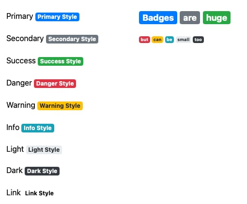
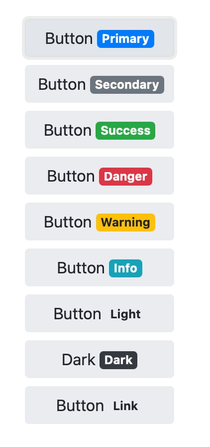

# Xojo-Web2.0-Bootstrap-Extensions
Adds some Bootstrap functionality that is currently missing in Xojo Web2.0 Framework

To add badges to weblabels use the extend-method on weblabel:

# Usage
`Weblabel.AddBadge(Text as String, Indicator as WebUIControl.Indicators = WebUIControl.Indicators.Default)`

`WebButton.AddBadge(Text as String, Indicator as WebUIControl.Indicators = WebUIControl.Indicators.Default)`

